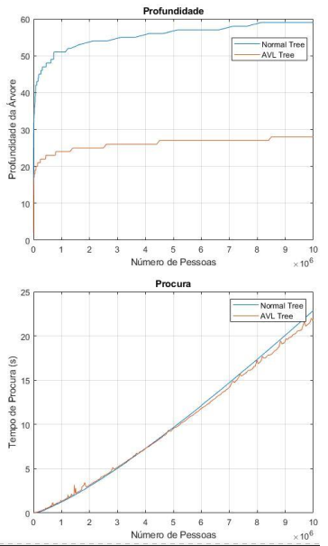

Algorithms and Data Structures Assignment 

Graded 19 out of 20

# Binary_Trees

Work carried out within Algorithms and Data Structures course.
Implementation of different operations and searches in multidimensional binary trees as well as AVL trees.

